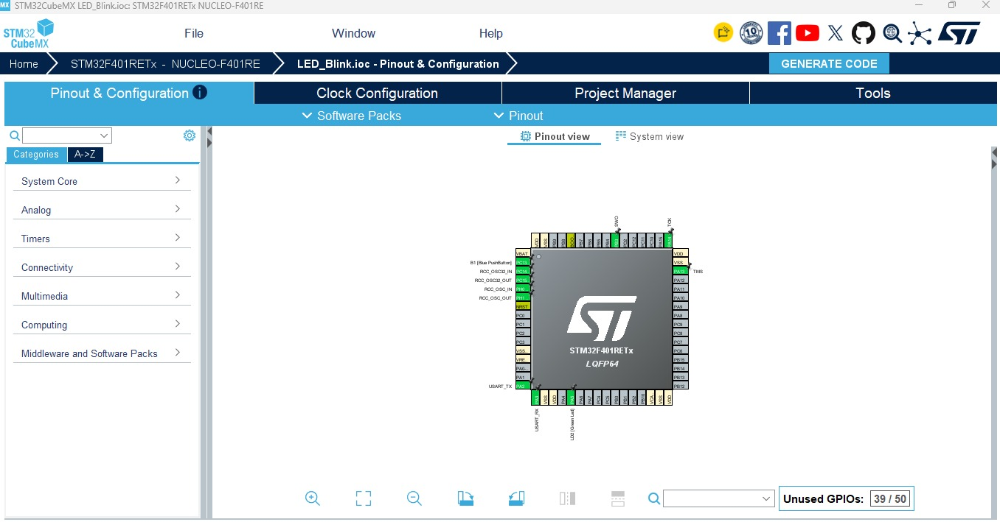
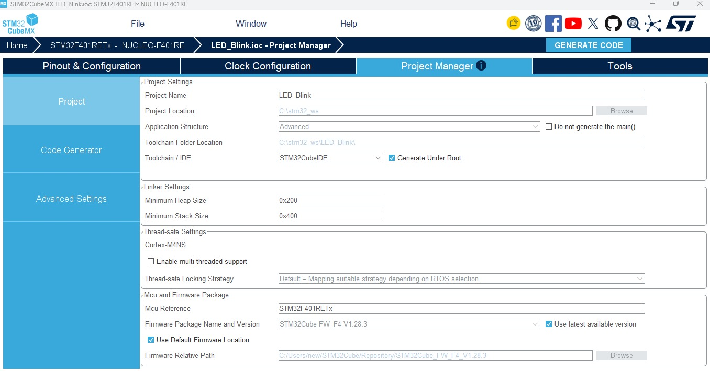
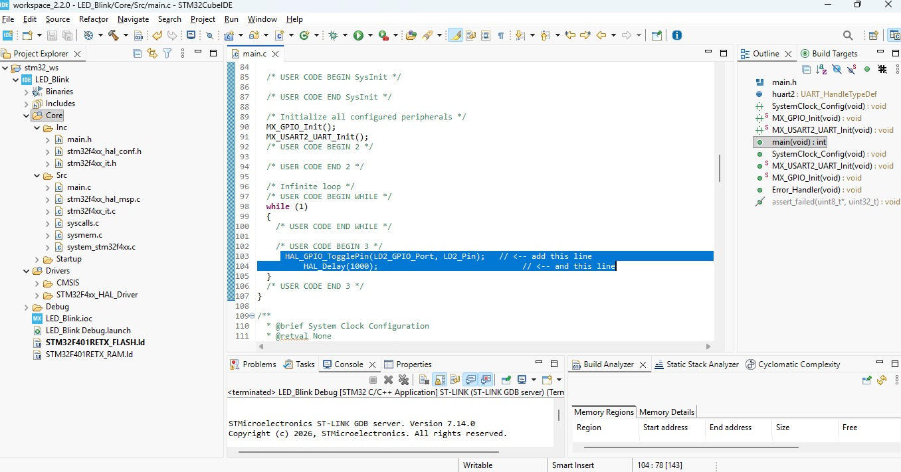
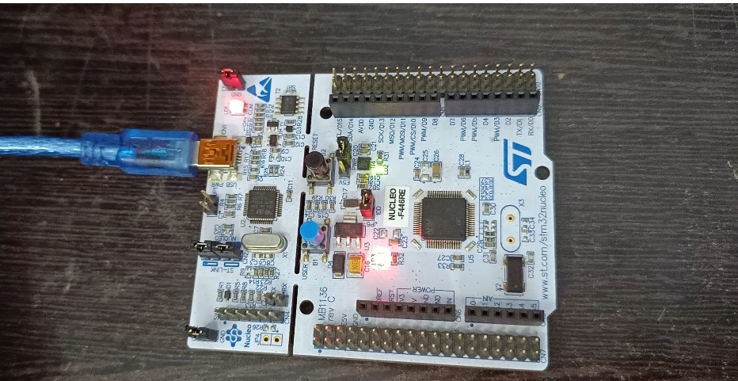

# STM32 NUCLEO-F446RE LED Blink


A beginner-friendly embedded project that blinks the on-board green user LED (**LD2**) of the **STM32 NUCLEO-F446RE** using the STM32 HAL library. The project is configured in **STM32CubeMX** and built, flashed and run in **STM32CubeIDE 2.2.0**.

---

## Table of Contents

1. [Project Overview](#project-overview)
2. [Key Features](#key-features)
3. [Hardware Required](#hardware-required)
4. [System Architecture](#system-architecture)
5. [STM32CubeMX Configuration](#stm32cubemx-configuration)
   - [Pinout & Configuration](#1-pinout--configuration-tab)
   - [Project Manager](#2-project-manager-tab)
6. [Firmware (STM32CubeIDE main.c)](#firmware-stm32cubeide-mainc)
7. [Working Principle](#working-principle)
8. [Output](#output)
9. [How to Run](#how-to-run)
10. [Testing](#testing)
11. [Troubleshooting](#troubleshooting)
12. [Technologies and Concepts](#technologies-and-concepts)
13. [Future Improvements](#future-improvements)
14. [Project Video](#project-video)

---

## Project Overview

The on-board LED **LD2** stays **ON for 1 second** and **OFF for 1 second**, giving a blink cycle of **2 seconds**. The LED is toggled in the main loop with `HAL_GPIO_TogglePin()`, and the delay is created with `HAL_Delay()`.

## Key Features

- STM32 NUCLEO-F446RE board
- On-board LED (LD2) control on pin **PA5**
- GPIO output configured with STM32CubeMX
- STM32 HAL library
- Toggle-based LED blinking with a 1 second delay
- Programming and debugging through the on-board ST-LINK

## Hardware Required

| Component                 | Quantity |
| ------------------------- | -------- |
| STM32 NUCLEO-F446RE board | 1        |
| USB cable (data cable)    | 1        |

No external components are needed because the LED is on the board.

## System Architecture

```
PC (STM32CubeIDE)
       │  USB
       ▼
 On-board ST-LINK  ──►  STM32F4 Microcontroller
                                │
                          GPIO Pin PA5
                                │
                                ▼
                       On-board LED (LD2)
```

---

## STM32CubeMX Configuration

### 1. Pinout & Configuration Tab

| Item                  | Setting                              |
| --------------------- | ------------------------------------ |
| Board                 | NUCLEO-F446RE (Board Selector)       |
| Pin                   | **PA5**                              |
| Pin mode              | `GPIO_Output`                        |
| User label            | `LD2`                                |
| GPIO output level     | Low                                  |
| GPIO mode             | Output Push Pull                     |
| GPIO Pull-up/Pull-down| No pull-up and no pull-down          |
| Maximum output speed  | Low                                  |

Path in CubeMX: `Pinout & Configuration → System Core → GPIO → PA5`



### 2. Project Manager Tab

**Project settings**

| Setting                | Value                           |
| ---------------------- | ------------------------------- |
| Project Name           | `<your project name>`           |
| Project Location       | `<your project folder>`         |
| Toolchain / IDE        | **STM32CubeIDE**                |
| Firmware Package       | `<STM32Cube FW_F4 version>`     |

**Code Generator**

| Option                                                   | State     |
| -------------------------------------------------------- | --------- |
| Copy only the necessary library files                    | Selected  |
| Generate peripheral initialization as a pair of .c/.h    | Unchecked |

After setting these options, click **GENERATE CODE**.



---

## Firmware (STM32CubeIDE main.c)

File: `Core/Src/main.c`

The blink logic is written inside the `USER CODE BEGIN 3` section of the `while (1)` loop:

```c
int main(void)
{
  HAL_Init();
  SystemClock_Config();
  MX_GPIO_Init();

  while (1)
  {
    /* USER CODE BEGIN 3 */
    HAL_GPIO_TogglePin(LD2_GPIO_Port, LD2_Pin);
    HAL_Delay(1000);
    /* USER CODE END 3 */
  }
}
```

The GPIO initialization generated by CubeMX (`MX_GPIO_Init`) configures PA5 as a push-pull output:

```c
static void MX_GPIO_Init(void)
{
  GPIO_InitTypeDef GPIO_InitStruct = {0};

  __HAL_RCC_GPIOC_CLK_ENABLE();
  __HAL_RCC_GPIOH_CLK_ENABLE();
  __HAL_RCC_GPIOA_CLK_ENABLE();

  HAL_GPIO_WritePin(LD2_GPIO_Port, LD2_Pin, GPIO_PIN_RESET);

  GPIO_InitStruct.Pin = LD2_Pin;
  GPIO_InitStruct.Mode = GPIO_MODE_OUTPUT_PP;
  GPIO_InitStruct.Pull = GPIO_NOPULL;
  GPIO_InitStruct.Speed = GPIO_SPEED_FREQ_LOW;
  HAL_GPIO_Init(LD2_GPIO_Port, &GPIO_InitStruct);
}
```

> The generated file also contains `SystemClock_Config()` and other CubeMX code, which is not shown here. Only the lines between `USER CODE BEGIN` and `USER CODE END` were written manually.



---

## Working Principle

1. `HAL_Init()` initializes the HAL library and the SysTick timer.
2. `MX_GPIO_Init()` enables the GPIO clock and configures PA5 as an output.
3. In the infinite loop, `HAL_GPIO_TogglePin()` flips the state of LD2.
4. `HAL_Delay(1000)` waits 1000 ms before the next toggle.

```
LED ON  → wait 1 s → LED OFF → wait 1 s → repeat
```

## Output

The green LED (LD2) on the board blinks continuously with a 2 second cycle.



## How to Run

1. Open **STM32CubeIDE**.
2. Go to `File → Import → General → Existing Projects into Workspace`.
3. Select the project folder and click **Finish**.
4. Build the project with the hammer icon.
5. Connect the board with a USB cable.
6. Click **Run** and accept the default debug configuration.

## Testing

| Test                  | Result                           |
| --------------------- | -------------------------------- |
| Build                 | 0 errors, 0 warnings             |
| Flash through ST-LINK | Successful                       |
| LD2 blinking          | Every 1 second ON / 1 second OFF |

## Troubleshooting

| Problem | Solution |
| ------- | -------- |
| `Error in initializing ST-LINK device. Reason: No device found on target.` | Fit both **CN2** jumper caps on the board. |
| Board not detected | Use a **data-capable** USB cable. Some cables only charge. |
| My code disappeared after regenerating | Write code only between `USER CODE BEGIN` and `USER CODE END`. Everything else is overwritten by CubeMX. |

## Technologies and Concepts

- STM32 NUCLEO-F446RE
- STM32CubeIDE 2.2.0
- STM32CubeMX
- STM32 HAL library
- GPIO output
- `HAL_GPIO_TogglePin`
- `HAL_Delay`
- ST-LINK programming and debugging

## Future Improvements

- Two external LEDs blinking alternately
- Push button controlled LEDs
- Ultrasonic sensor distance measurement
- 16×2 I2C LCD display
- UART serial output
- Timer-based blinking without `HAL_Delay`

## Project Video

[▶️ Watch the LED Blink Demonstration](https://drive.google.com/file/d/1-alz60q_yz7m7Dc0q-guLLVWQuhK1pGI/view?usp=drivesdk)
